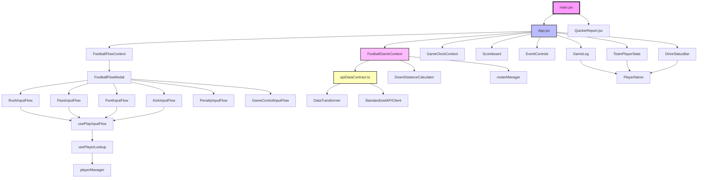

# 00-Repo-Map.md - Repository Structure and Module Dependencies

## Complete File Tree of src/ Directory

```
src/
├── App.jsx                          # Main application component with routing logic
├── main.jsx                         # Entry point, React root setup with routing
├── index.css                        # TailwindCSS with football-themed styles
│
├── components/                      # UI Components
│   ├── APIStatus.jsx               # API connection status indicator
│   ├── DebugPanel.jsx              # Development debugging interface
│   ├── DriveStatusBar.jsx          # Current drive statistics display
│   ├── EventControls.jsx           # Play input control interface
│   ├── FootballFlowModal.jsx       # Modal for play input flows
│   ├── FootballHotkeyHandler.jsx   # Global keyboard shortcuts
│   ├── GameLog.jsx                 # Play-by-play log display
│   ├── InputAssistant.jsx          # Input guidance for users
│   ├── JerseyNumberInput.jsx       # Player jersey number input
│   ├── PenaltyInputModal.jsx       # Penalty input interface
│   ├── PenaltyModal.jsx            # Penalty decision modal
│   ├── PlayDescription.jsx         # Formatted play descriptions
│   ├── PlayEditModal.jsx           # Edit existing plays
│   ├── PlayerDisambiguationModal.jsx # Resolve player name conflicts
│   ├── PlayerInput.jsx             # Player selection input
│   ├── PlayerName.jsx              # Player name display component
│   ├── PlayerRosterBar.jsx         # Team roster display
│   ├── PlayerSuggestion.jsx        # Player autocomplete suggestions
│   ├── ReportsButton.jsx           # Link to reports interface
│   ├── RosterManagement.jsx        # Team roster management
│   ├── Scoreboard.jsx              # Game score and time display
│   ├── TeamPlayerStats.jsx         # Team and player statistics
│   ├── YardlineInput.jsx           # Field position input
│   │
│   └── PlayInputFlows/             # Modular Play Input Workflows
│       ├── GameControlInputFlow.jsx # Game management (timeouts, etc.)
│       ├── KickInputFlow.jsx       # Field goal/kickoff input
│       ├── PassInputFlow.jsx       # Passing play input
│       ├── PenaltyInputFlow.jsx    # Penalty input workflow
│       ├── PlayTypeSelector.jsx    # Play type selection interface
│       ├── PuntInputFlow.jsx       # Punting play input
│       └── RushInputFlow.jsx       # Running play input
│
├── contexts/                        # React Context Providers
│   ├── FootballFlowContext.jsx     # Play input flow state management
│   ├── FootballGameContext.jsx     # Main game state management
│   └── GameClockContext.jsx        # Game clock and timing
│
├── hooks/                           # Custom React Hooks
│   ├── usePlayInputFlow.jsx        # Shared play input logic
│   └── usePlayerLookup.js          # Player search and lookup
│
├── pages/                           # Route-based Page Components
│   └── QuickieReport.jsx           # Game summary report
│
├── utils/                           # Utility Functions and Helpers
│   ├── DownDistanceCalculator.js   # Football game logic calculations
│   ├── apiDataContract.ts          # API standardization layer (TypeScript)
│   ├── debug.js                    # Development logging utility
│   ├── playerManager.js            # Player data management
│   ├── positionPriority.js         # Player position handling
│   ├── rosterManager.js            # Team roster caching and management
│   └── teamSide.js                 # Team identification helpers
│
└── services/                        # External Service Integrations (currently empty)
```

## Project Root Files

```
strata-football-ui-new/
├── package.json                     # Dependencies and build scripts
├── vite.config.js                   # Vite build configuration with proxy
├── tailwind.config.js               # TailwindCSS with football theme
├── postcss.config.js                # PostCSS configuration
├── index.html                       # HTML template
├── README.md                        # Project README
│
├── api/                             # Backend API interface files
│   ├── load_game_state.php         # Game state loader
│   ├── submit_play.php             # Play submission
│   ├── get_games.php               # Game list retrieval
│   ├── start_scoring.php           # Scoring session start
│   └── end_scoring.php             # Scoring session end
│
├── test_files/                      # Test infrastructure
│   ├── test-down-distance.js       # Down/distance calculation tests
│   └── test_frontend_contract.mjs   # Data contract validation tests
│
└── documentation/                   # Generated documentation (this directory)
    └── [14 documentation files]
```

## Module Dependency Overview

### Top 30 Modules by Fan-in/Fan-out

#### High Fan-in (Most Imported) Modules:

1. **React ecosystem** (`react`, `react-dom`) - Used by 20+ components
   - Every component imports React hooks

2. **debug.js** (`src/utils/debug.js`) - Used by 15+ components
   - Central logging and debugging utility

3. **FootballGameContext** (`src/contexts/FootballGameContext.jsx`) - Used by 12+ components
   - Primary game state provider

4. **FootballFlowContext** (`src/contexts/FootballFlowContext.jsx`) - Used by 10+ components  
   - Play input flow orchestration

5. **apiDataContract.ts** (`src/utils/apiDataContract.ts`) - Used by 8+ components
   - Data transformation and validation

6. **playerManager.js** (`src/utils/playerManager.js`) - Used by 7+ components
   - Player lookup and resolution

7. **GameClockContext** (`src/contexts/GameClockContext.jsx`) - Used by 5+ components
   - Clock management

8. **rosterManager.js** (`src/utils/rosterManager.js`) - Used by 5+ components
   - Roster caching and management

9. **DownDistanceCalculator.js** (`src/utils/DownDistanceCalculator.js`) - Used by 4+ components
   - Game logic calculations

10. **PlayerName** (`src/components/PlayerName.jsx`) - Used by 4+ components
    - Player display formatting

#### High Fan-out (Import Many) Modules:

1. **App.jsx** - Imports 15+ modules
   - Main application orchestrator

2. **FootballGameContext.jsx** - Imports 10+ modules
   - Central state management hub

3. **GameLog.jsx** - Imports 8+ modules
   - Complex play display logic

4. **TeamPlayerStats.jsx** - Imports 7+ modules
   - Statistics aggregation

5. **RushInputFlow.jsx** - Imports 7+ modules
   - Complex flow logic

6. **PassInputFlow.jsx** - Imports 7+ modules
   - Complex flow logic

7. **PuntInputFlow.jsx** - Imports 6+ modules
   - Complex flow logic

8. **KickInputFlow.jsx** - Imports 6+ modules
   - Complex flow logic

9. **DriveStatusBar.jsx** - Imports 5+ modules
   - Drive statistics display

10. **FootballFlowModal.jsx** - Imports 5+ modules
    - Flow routing and orchestration

## High-Level Module Dependency Graph



## Import Patterns Analysis

### Context Usage Pattern
```javascript
// Most components follow this pattern:
import { useGameState } from '../contexts/FootballGameContext';
import { useFootballFlow } from '../contexts/FootballFlowContext';
import { useGameClock } from '../contexts/GameClockContext';
```

### Utility Import Pattern
```javascript
// Common utility imports:
import debug from '../utils/debug';
import { playerManager } from '../utils/playerManager';
import { DownDistanceCalculator } from '../utils/DownDistanceCalculator';
```

### Component Import Pattern
```javascript
// Shared component imports:
import PlayerName from './PlayerName';
import YardlineInput from './YardlineInput';
import JerseyNumberInput from './JerseyNumberInput';
```

## Module Categories

### 1. **Core Infrastructure** (High Dependency)
- Context providers (Game, Flow, Clock)
- API contract layer
- Debug utility

### 2. **Data Management** (Medium Dependency)
- Player manager
- Roster manager
- Down/distance calculator

### 3. **UI Components** (Low Dependency)
- Display components (Scoreboard, GameLog)
- Input components (YardlineInput, JerseyNumberInput)
- Flow components (RushInputFlow, PassInputFlow)

### 4. **Utility Modules** (Zero External Dependencies)
- teamSide.js
- positionPriority.js

## Circular Dependencies
No circular dependencies detected in the module graph.

## Dead Code Analysis
- **services/** directory is empty and unused
- All other files in src/ are actively imported and used

## Module Health Score
- **Excellent**: Clear separation of concerns
- **Good**: Consistent import patterns
- **Needs Attention**: Some components have high fan-out (could benefit from refactoring)