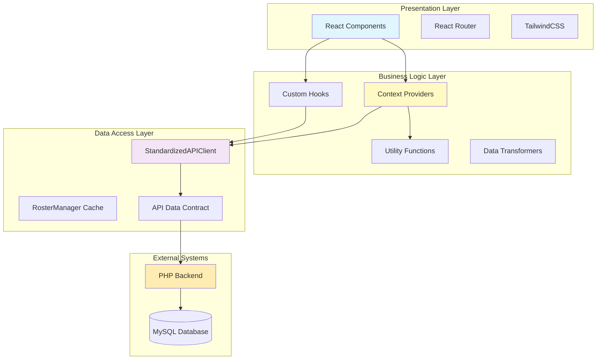
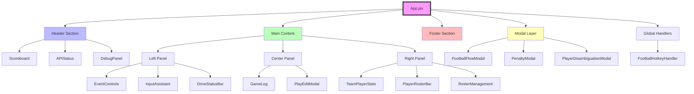
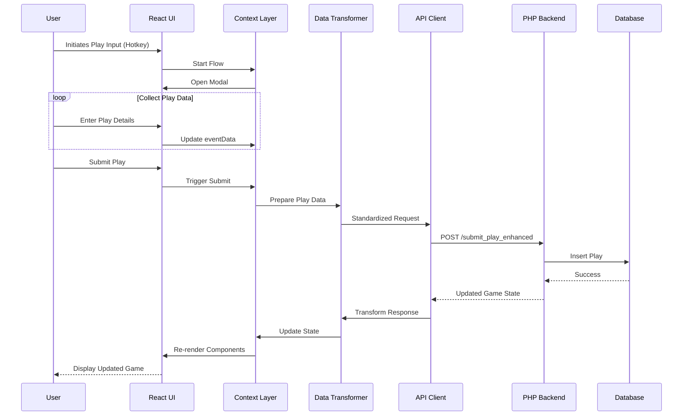

# 01-Architecture.md - Application Architecture Overview

## Technology Stack

### Frontend Framework
- **React 18.2.0**: Modern React with hooks and functional components
- **React Router DOM 7.8.1**: Client-side routing for SPA navigation
- **PropTypes**: Runtime type checking for React props

### Build Tools
- **Vite 4.4.5**: Fast build tool with HMR (Hot Module Replacement)
- **PostCSS**: CSS processing pipeline
- **Autoprefixer 10.4.14**: Automatic vendor prefixing

### Styling
- **TailwindCSS 3.3.3**: Utility-first CSS framework
- **Custom Theme**: Football-themed color palette (green field, team colors)

### State Management
- **React Context API**: Built-in context for global state
- **useReducer**: Complex state logic in FootballGameContext
- **useState**: Simple state management in components

### Data Layer
- **TypeScript** (partial): Type definitions in apiDataContract.ts
- **Custom API Client**: StandardizedAPIClient for backend communication
- **Data Transformation**: Automatic camelCase ↔ snake_case conversion

### Backend Integration
- **PHP Backend**: RESTful API endpoints
- **MySQL Database**: Persistent storage (inferred from PHP patterns)
- **Proxy Configuration**: Vite proxy for development API routing

## Application Architecture Overview

### Three-Layer Architecture



## State Flow Through the Application

### Primary State Providers

#### 1. FootballGameContext (`src/contexts/FootballGameContext.jsx`)
**Purpose**: Central game state management

**State Structure**:
```javascript
{
  gameData: {
    game_info: { /* team names, IDs, venue */ },
    live_state: { /* score, possession, down/distance */ },
    recent_plays: [ /* play history */ ],
    team_stats: { /* aggregated statistics */ },
    player_stats: { /* individual statistics */ }
  },
  isSubmitting: boolean,
  error: string | null,
  apiStatus: 'connected' | 'connecting' | 'error',
  currentDrive: { /* active drive data */ }
}
```

**Key Actions**:
- `LOAD_GAME_STATE`: Initialize game data
- `UPDATE_LIVE_STATE`: Real-time game updates
- `ADD_PLAY`: Add new play to history
- `SET_ERROR`: Error handling
- `SET_SUBMITTING`: Loading states

#### 2. FootballFlowContext (`src/contexts/FootballFlowContext.jsx`)
**Purpose**: Play input workflow orchestration

**State Structure**:
```javascript
{
  currentFlow: 'rush' | 'pass' | 'punt' | 'kick' | 'penalty' | null,
  flowStep: string,
  eventData: { /* accumulated play data */ },
  isModalOpen: boolean,
  availableShortcuts: ['R', 'P', 'U', 'K', 'E', 'G']
}
```

**Flow Management**:
- Keyboard shortcut handling
- Modal state control
- Step progression tracking
- Data accumulation

#### 3. GameClockContext (`src/contexts/GameClockContext.jsx`)
**Purpose**: Game timing management

**State Structure**:
```javascript
{
  quarter: number,
  timeRemaining: string, // "MM:SS"
  playClock: number,
  isRunning: boolean
}
```

## Component Architecture

### Component Tree (Top 2 Levels)



## Data Flow Diagram



## Event/Command Bus Architecture

### No Formal Event Bus
The application doesn't implement a formal event bus pattern. Instead, it uses:

1. **Context-based Event Propagation**
   - State changes in contexts trigger re-renders
   - Components subscribe via hooks (`useGameState`, `useFootballFlow`)

2. **Direct Function Calls**
   - Parent components pass callbacks as props
   - Direct API calls from components

3. **Keyboard Event System**
   - Global hotkey handler (`FootballHotkeyHandler`)
   - Flow-specific keyboard handlers in input components

### Side Effects Location

#### API Side Effects
**Location**: `src/contexts/FootballGameContext.jsx`
```javascript
// Lines 460-480: Game state loading
useEffect(() => {
  loadGameState();
}, [gameId]);

// Lines 680-700: Health check polling
useEffect(() => {
  const interval = setInterval(checkAPIHealth, 30000);
  return () => clearInterval(interval);
}, []);
```

#### Data Caching Side Effects
**Location**: `src/utils/rosterManager.js`
```javascript
// Lines 15-30: Cache management
class RosterManager {
  constructor() {
    this.cache = new Map();
    this.cacheTimeout = 5 * 60 * 1000; // 5 minutes
  }
}
```

#### UI Side Effects
**Location**: Various input flow components
- Auto-focus on input fields
- Keyboard event listeners
- Modal lifecycle management

## Module Communication Patterns

### 1. **Provider-Consumer Pattern**
```javascript
// Provider wrapping
<FootballGameProvider>
  <FootballFlowProvider>
    <GameClockProvider>
      <App />
    </GameClockProvider>
  </FootballFlowProvider>
</FootballGameProvider>

// Consumer usage
const { gameData, submitPlay } = useGameState();
```

### 2. **Prop Drilling Avoidance**
- Contexts eliminate prop drilling for global state
- Local state kept in components when appropriate

### 3. **Custom Hook Abstraction**
```javascript
// Shared logic extraction
const usePlayInputFlow = ({ onComplete, onCancel }) => {
  // Common flow logic
  return { handleSubmit, errors, ... };
};
```

## Build and Deployment Architecture

### Development Server
```bash
npm run dev
# Starts Vite dev server on http://localhost:5173
# Proxies /strata_football/* to backend
```

### Production Build
```bash
npm run build
# Outputs to dist/ directory
# Minified and optimized bundles
```

### Key Configuration (`vite.config.js`)
```javascript
export default defineConfig({
  plugins: [react()],
  server: {
    proxy: {
      '/strata_football': {
        target: 'http://localhost',
        changeOrigin: true
      }
    }
  }
});
```

## Security Architecture

### Frontend Security
1. **No Credentials in Code**: API endpoints only, no keys
2. **Input Validation**: Client-side validation before submission
3. **XSS Protection**: React's built-in escaping

### API Security
1. **CORS Configuration**: Proper origin restrictions
2. **Session Management**: PHP session-based auth
3. **Data Validation**: Server-side validation of all inputs

## Performance Optimizations

### 1. **Component Memoization**
- Limited use of React.memo
- Opportunity for optimization in frequently re-rendered components

### 2. **Data Caching**
- RosterManager: 5-minute cache for roster data
- Prevents redundant API calls

### 3. **Lazy Loading**
- Currently not implemented
- All components loaded synchronously

### 4. **Bundle Optimization**
- Vite's default code splitting
- Tree shaking via ES modules

## Scalability Considerations

### Current Limitations
1. **Single Game Focus**: Designed for one game at a time
2. **Synchronous Updates**: No real-time push updates
3. **Client-Side State**: All state in browser memory

### Growth Opportunities
1. **WebSocket Integration**: Real-time updates
2. **State Persistence**: LocalStorage or IndexedDB
3. **Code Splitting**: Route-based lazy loading
4. **TypeScript Migration**: Full type safety