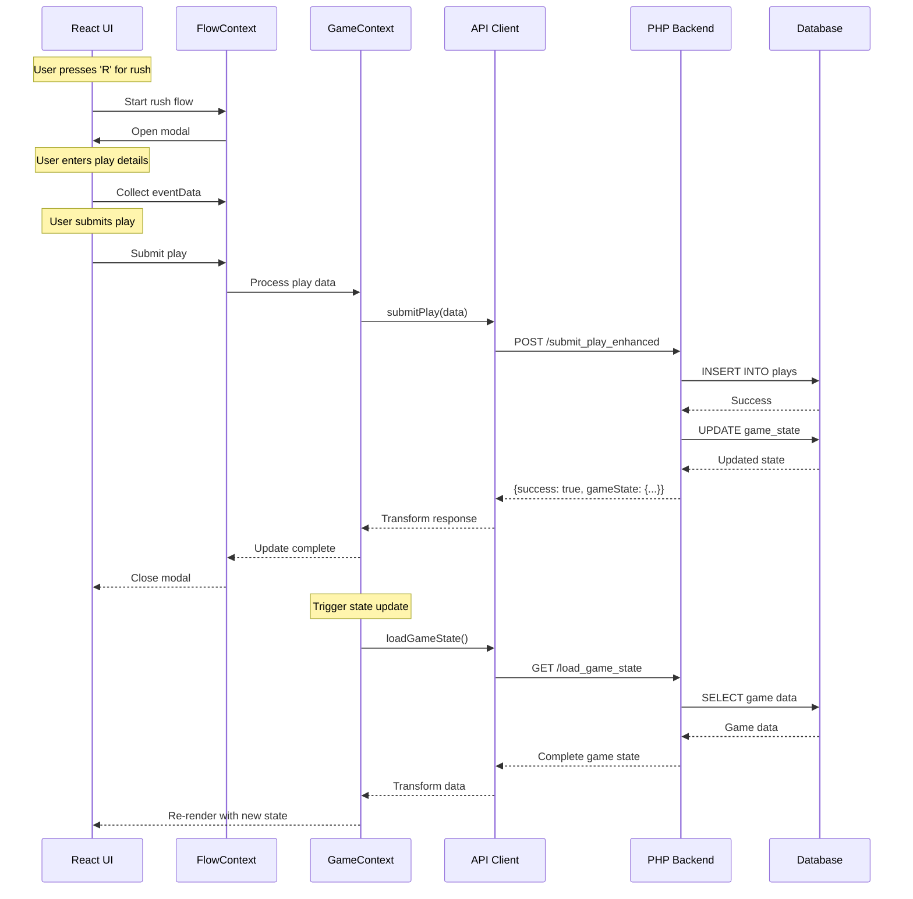

# 03-APIs-and-Endpoints.md - API Documentation and Network Calls

## API Architecture Overview

- **Technology**: RESTful HTTP APIs using fetch()
- **Format**: JSON request/response
- **Authentication**: PHP session-based
- **Error Handling**: Standardized error responses
- **Base Path**: `/strata_football/`
- **Proxy**: Development server proxies to localhost

## Primary API Endpoints

### 1. Load Game State

**Endpoint**: `/strata_football/api/load_game_state.php`  
**Method**: GET  
**Purpose**: Loads complete game state for scoring interface

#### Call Sites
- `src/contexts/FootballGameContext.jsx:465`
- `src/utils/apiDataContract.ts:465`

#### Request
```http
GET /strata_football/api/load_game_state.php?game_id=999
```

#### Response
```json
{
  "success": true,
  "gameState": {
    "gameId": 999,
    "period": 1,
    "timeRemaining": "15:00",
    "possession": "H",
    "down": 1,
    "yardsToGo": 10,
    "yardLinePosition": "H25",
    "score": {"H": 0, "V": 0},
    "status": "active",
    "timeouts": {"H": 3, "V": 3}
  },
  "gameInfo": {
    "home_team_name": "Home Team",
    "visitor_team_name": "Away Team",
    "venue": "Stadium Name"
  },
  "playLog": [
    {
      "play_number": 1,
      "play_type": "rush",
      "description": "Rush for 5 yards"
    }
  ],
  "stats": {
    "team": {},
    "player": {}
  },
  "driveChart": []
}
```

#### Error Response
```json
{
  "success": false,
  "error": "Game not found",
  "message": "No game exists with ID 999"
}
```

### 2. Submit Play Enhanced

**Endpoint**: `/strata_football/api/submit_play_enhanced.php`  
**Method**: POST  
**Content-Type**: application/json  
**Purpose**: Submits plays with comprehensive data transformation

#### Call Sites
- `src/utils/apiDataContract.ts:501`
- `src/hooks/usePlayInputFlow.jsx:118`
- All play input flow components

#### Request
```json
{
  "game_id": 999,
  "play_data": {
    "play_type": "rush",
    "primary_player_id": 123,
    "yards": 5,
    "end_yard_line": "H30",
    "post_down": 2,
    "post_distance": 5,
    "is_first_down": false,
    "has_fumble": false,
    "is_touchdown": false,
    "is_turnover": false,
    "is_safety": false,
    "tackler1_jersey": "45",
    "tackler2_jersey": null,
    "timestamp": "2025-08-26T10:30:00.000Z"
  },
  "session_id": "abc123",
  "user_id": "scorer1"
}
```

#### Response
```json
{
  "success": true,
  "play_id": 456,
  "gameState": {
    "down": 2,
    "yardsToGo": 5,
    "yardLinePosition": "H30"
  },
  "playLog": [...],
  "message": "Play successfully submitted",
  "timestamp": "2025-08-26T10:30:00.000Z"
}
```

### 3. Get Rosters

**Endpoint**: `/strata_football/api/get_rosters.php`  
**Method**: GET  
**Purpose**: Retrieves team rosters for player lookup

#### Call Sites
- `src/contexts/FootballGameContext.jsx:111`
- `src/utils/rosterManager.js:63`

#### Request
```http
GET /strata_football/api/get_rosters.php?gameId=999
```

#### Response
```json
{
  "success": true,
  "rosters": {
    "home": [
      {
        "player_id": 123,
        "jersey_number": "12",
        "full_name": "John Smith",
        "first_name": "John",
        "last_name": "Smith",
        "off_position": "QB",
        "def_position": "S",
        "class": "JR",
        "height": "6'2\"",
        "weight": 215
      }
    ],
    "visitor": [...]
  },
  "timestamp": "2025-08-26T10:30:00Z"
}
```

### 4. Update Game Clock

**Endpoint**: `/strata_football/api/update_game_clock.php`  
**Method**: POST  
**Purpose**: Updates game timing and period

#### Call Sites
- `src/contexts/FootballGameContext.jsx:509`

#### Request
```json
{
  "game_id": 999,
  "quarter": 2,
  "time_remaining": "12:45",
  "play_clock": 40
}
```

#### Response
```json
{
  "success": true,
  "message": "Clock updated",
  "new_state": {
    "quarter": 2,
    "time_remaining": "12:45"
  }
}
```

### 5. Delete Play

**Endpoint**: `/strata_football/api/delete_play.php`  
**Method**: POST  
**Purpose**: Removes a play from the game log

#### Call Sites
- `src/App.jsx:165`

#### Request
```json
{
  "game_id": "999",
  "overall_play_num": 25
}
```

#### Response
```json
{
  "success": true,
  "message": "Play deleted successfully",
  "updated_game_state": {...}
}
```

### 6. Insert Play

**Endpoint**: `/strata_football/api/insert_play.php`  
**Method**: POST  
**Purpose**: Inserts a blank play at specific position

#### Call Sites
- `src/App.jsx:187`

#### Request
```json
{
  "gameId": "999",
  "playNumber": 26
}
```

#### Response
```json
{
  "success": true,
  "message": "Play inserted",
  "new_play_id": 789
}
```

### 7. Health Check

**Endpoint**: `/strata_football/health_check.php`  
**Method**: GET  
**Timeout**: 5000ms  
**Purpose**: Monitors API connectivity

#### Call Sites
- `src/contexts/FootballGameContext.jsx:690`

#### Request
```http
GET /strata_football/health_check.php
```

#### Response
```json
{
  "status": "healthy",
  "timestamp": "2025-08-26T10:30:00Z",
  "database": "connected",
  "version": "1.0.0"
}
```

## Secondary API Endpoints

### 8. Update Rosters

**Endpoint**: `/strata_football/api/update_rosters.php`  
**Method**: POST

#### Call Sites
- `src/components/RosterManagement.jsx:36`

#### Request
```json
{
  "game_id": 999,
  "rosters": {
    "home": [...],
    "visitor": [...]
  }
}
```

### 9. Initialize Rosters

**Endpoint**: `/strata_football/api/initialize_rosters.php`  
**Method**: POST

#### Call Sites
- `src/contexts/FootballGameContext.jsx:536`

#### Request
```json
{
  "game_id": 999,
  "home_team_id": 1,
  "visitor_team_id": 2
}
```

### 10. Get Player by Jersey

**Endpoint**: `/strata_football/api/get_player_by_jersey.php`  
**Method**: GET

#### Call Sites
- `src/utils/playerManager.js:71`

#### Request
```http
GET /strata_football/api/get_player_by_jersey.php?gameId=999&team=home&jerseyNumber=12
```

### 11. Get Player Details

**Endpoint**: `/strata_football/api/get_player_details.php`  
**Method**: GET/POST

#### Call Sites
- `src/utils/playerManager.js:141`
- `src/utils/playerManager.js:188`

#### GET Request
```http
GET /strata_football/api/get_player_details.php?playerId=123
```

#### POST Request
```json
{
  "player_ids": [123, 456, 789]
}
```

### 12. Get Penalty Chart

**Endpoint**: `/strata_football/api/get_penalty_chart.php`  
**Method**: GET

#### Call Sites
- `src/components/PenaltyInputModal.jsx:74`
- `src/components/PenaltyModal.jsx:25`

#### Response
```json
{
  "penalties": [
    {
      "code": "HOLD",
      "name": "Holding",
      "yards": 10,
      "automatic_first": false
    }
  ]
}
```

### 13. Quickie Report

**Endpoint**: `/strata_football/php/reports/quickie_report.php`  
**Method**: GET

#### Call Sites
- `src/pages/QuickieReport.jsx:14`

#### Request
```http
GET /strata_football/php/reports/quickie_report.php?game_id=999
```

### 14. Update Play

**Endpoint**: `/strata_football/api/update_play.php`  
**Method**: POST

#### Call Sites
- `src/components/PlayEditModal.jsx:13`

#### Request
```json
{
  "game_id": 999,
  "play_number": 25,
  "play_data": {
    "play_type": "rush",
    "yards": 7
  }
}
```

## API Client Implementation

### StandardizedAPIClient (`src/utils/apiDataContract.ts`)

```typescript
class StandardizedAPIClient {
  static async loadGameState(gameId: string): Promise<StandardGameState> {
    const response = await fetch(
      `/strata_football/api/load_game_state.php?game_id=${gameId}`
    );
    if (!response.ok) {
      throw new Error(`HTTP error! status: ${response.status}`);
    }
    const data = await response.json();
    return DataTransformer.transformGameState(data);
  }
  
  static async submitPlay(
    gameId: string,
    playData: StandardPlayData
  ): Promise<StandardAPIResponse> {
    const backendData = DataTransformer.frontendToBackend(playData);
    const response = await fetch(
      '/strata_football/api/submit_play_enhanced.php',
      {
        method: 'POST',
        headers: { 'Content-Type': 'application/json' },
        body: JSON.stringify({
          game_id: gameId,
          play_data: backendData
        })
      }
    );
    return response.json();
  }
}
```

## Error Handling Patterns

### Standard Error Response
```json
{
  "success": false,
  "error": "ERROR_CODE",
  "message": "Human readable error message",
  "details": {
    "field": "Additional error context"
  }
}
```

### Client-Side Error Handling
```javascript
try {
  const response = await fetch(url, options);
  if (!response.ok) {
    throw new Error(`HTTP error! status: ${response.status}`);
  }
  const result = await response.json();
  if (!result.success) {
    throw new Error(result.message || 'Operation failed');
  }
  return result;
} catch (error) {
  console.error('API call failed:', error);
  // Update UI with error state
  throw error;
}
```

## Sequence Diagram: Full Scoring Cycle



## Performance Considerations

### Caching Strategy
- **RosterManager**: 5-minute cache for roster data
- **No caching**: Game state always fetched fresh
- **Health check**: 30-second intervals

### Request Batching
- **Not implemented**: Each action triggers individual API call
- **Opportunity**: Could batch multiple operations

### Timeout Configuration
- **Default**: Browser default (typically 30s)
- **Health Check**: 5-second timeout
- **Others**: No explicit timeout

## Security Notes

1. **CORS**: Properly configured in Vite proxy
2. **Authentication**: PHP session-based (cookies)
3. **Input Validation**: Both client and server-side
4. **SQL Injection**: Prevented via prepared statements (backend)
5. **XSS Protection**: React's built-in escaping