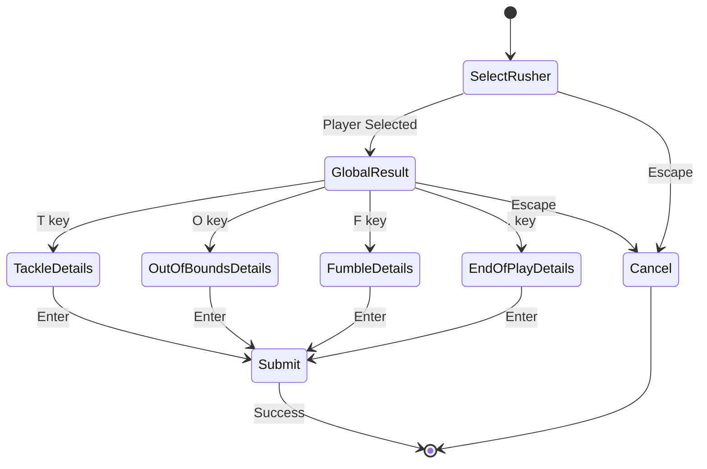
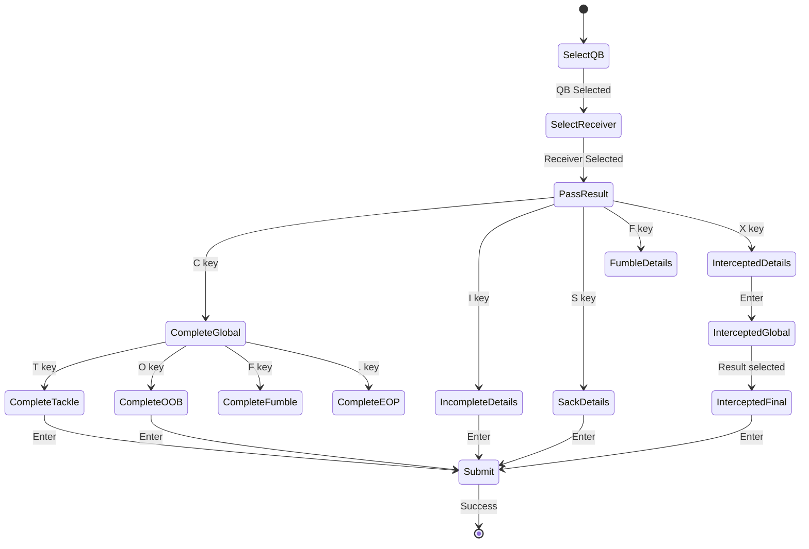
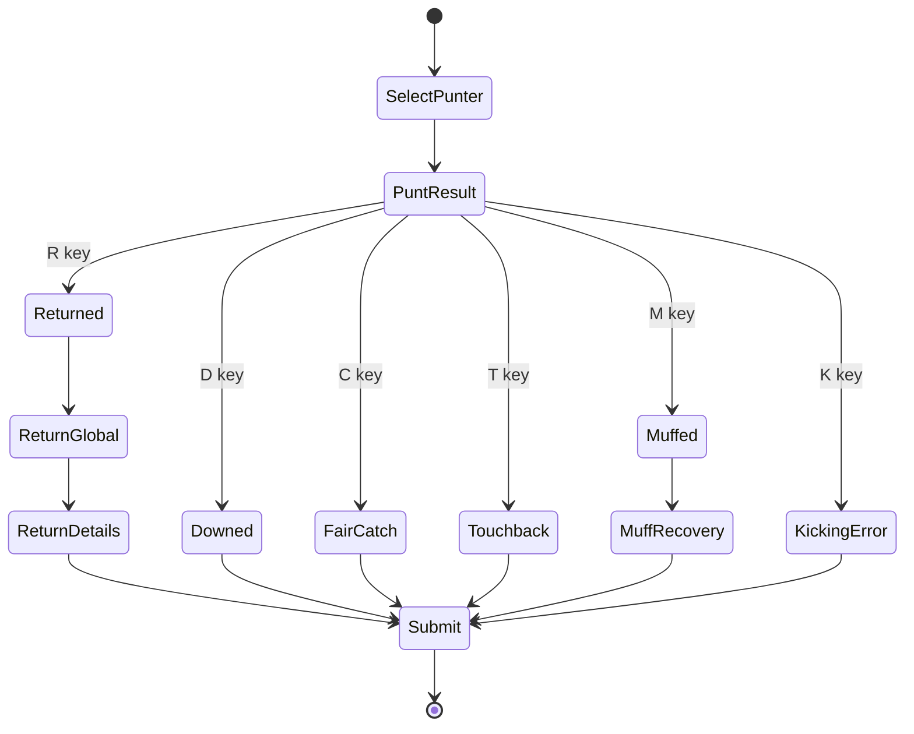
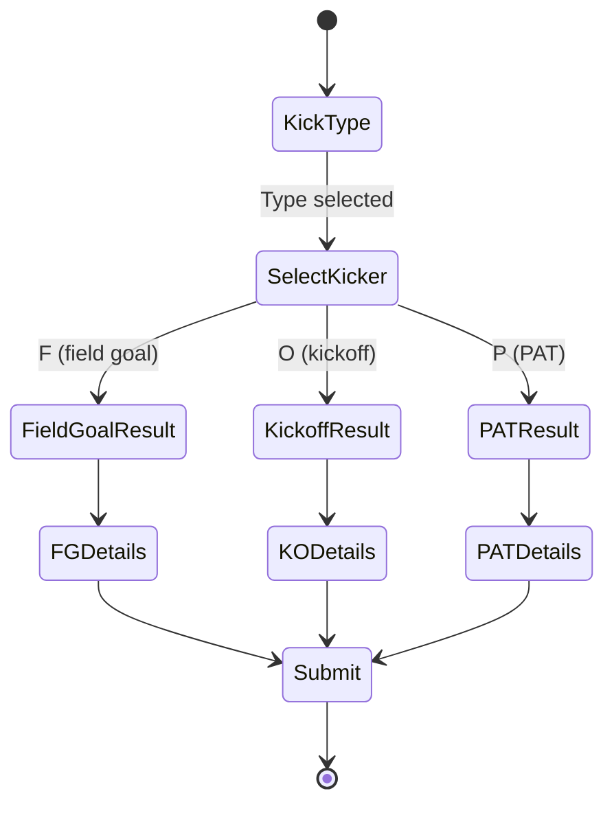

# 05-Play-Input-and-Flows.md - Play Input Flows and State Machines

## Flow Architecture Overview

The play input system uses a modal-based, keyboard-driven workflow with these components:

1. **FootballFlowModal** - Central modal container
2. **Individual Flow Components** - Rush, Pass, Punt, Kick, Penalty, GameControl
3. **usePlayInputFlow Hook** - Shared flow logic
4. **Keyboard Handlers** - Global and flow-specific shortcuts

## Flow Trigger Mechanisms

### Global Keyboard Shortcuts
**File**: `src/components/FootballHotkeyHandler.jsx`

| Key | Flow Type | Component Triggered |
|-----|-----------|-------------------|
| R | Rush | RushInputFlow |
| P | Pass | PassInputFlow |
| U | Punt | PuntInputFlow |
| K | Kick | KickInputFlow |
| E | Penalty | PenaltyInputFlow |
| G | Game Control | GameControlInputFlow |

### Button Triggers
**File**: `src/components/EventControls.jsx`

Each flow can also be triggered via UI buttons with visual indicators showing the keyboard shortcut.

## 1. Rush Input Flow

**File**: `src/components/PlayInputFlows/RushInputFlow.jsx`

### State Machine


### Flow Steps

#### Step 1: Select Rusher
- **Input**: Jersey number
- **Validation**: Player must exist or create unknown
- **Team**: Possession team (offense)

#### Step 2: Global Result
- **Shortcuts**: T, O, F, .
- **Options**:
  - T = Tackle (most common)
  - O = Out of bounds
  - F = Fumble
  - . = End of play (TD, safety)

#### Step 3: Result-Specific Details

**Tackle Details**:
```javascript
{
  finalYardLine: "H35", // Required
  tackler1: "#45", // Required
  tackler2: "#23", // Optional
}
```

**Out of Bounds Details**:
```javascript
{
  finalYardLine: "V20", // Required
}
```

**Fumble Details**:
```javascript
{
  fumbleLocation: "H45", // Required
  recoveredBy: "defense", // Required
  recoveryLocation: "H48", // Required
  miscFumble: false // Optional checkbox
}
```

### Data Submission
```javascript
{
  play_type: "rush",
  primary_player_id: 123,
  result_code: "T",
  end_yard_line: "H35",
  post_down: 2,
  post_distance: 5,
  tackler1_jersey: "45",
  tackler2_jersey: "23",
  has_fumble: false,
  is_touchdown: false
}
```

## 2. Pass Input Flow

**File**: `src/components/PlayInputFlows/PassInputFlow.jsx`

### State Machine


### Flow Steps

#### Step 1: Select Quarterback
- **Input**: Jersey number
- **Team**: Possession team

#### Step 2: Select Receiver
- **Input**: Jersey number or "INC" for incomplete
- **Team**: Possession team
- **Special**: Can be empty for sack/fumble

#### Step 3: Pass Result
- **Shortcuts**: C, I, S, F, X
- **Options**:
  - C = Complete
  - I = Incomplete
  - S = Sack
  - F = Fumble (QB fumble)
  - X = Intercepted

#### Step 4: Result-Specific Details

**Complete Pass**:
```javascript
// First: Global result (T, O, F, .)
// Then: Details based on global result
{
  passComplete: true,
  receiver: playerData,
  yardsAfterCatch: calculated,
  finalYardLine: "V15",
  tacklers: [...]
}
```

**Incomplete Pass**:
```javascript
{
  passComplete: false,
  intendedReceiver: playerData,
  incompleteReason: "overthrown" // Optional
}
```

**Sack**:
```javascript
{
  sackLocation: "H28",
  sacker1: "#99",
  sacker2: "#55" // Optional
}
```

**Interception**:
```javascript
{
  interceptedBy: "#21",
  interceptionLocation: "V35",
  returnResult: "T", // T, O, F, .
  returnEndLocation: "H45",
  returnTacklers: [...]
}
```

## 3. Punt Input Flow

**File**: `src/components/PlayInputFlows/PuntInputFlow.jsx`

### State Machine


### Punt Results

| Code | Result | Required Fields |
|------|--------|----------------|
| R | Returned | Returner, end location, tacklers |
| D | Downed | Downing team, location |
| C | Fair Catch | Catcher, location |
| T | Touchback | None |
| M | Muffed | Recovery team, location |
| K | Kicking Error | Error type, location |

## 4. Kick Input Flow

**File**: `src/components/PlayInputFlows/KickInputFlow.jsx`

### State Machine


### Kick Types and Results

#### Field Goal
- **Results**: G (good), M (missed), B (blocked)
- **Data**: Distance, result

#### Kickoff
- **Results**: R (returned), T (touchback), O (out of bounds), N (onside)
- **Data**: Return details, field position

#### PAT (Point After Touchdown)
- **Results**: G (good), M (missed), B (blocked), 2 (two-point)
- **Data**: Type (kick/run/pass), result

### Special Kickoff Handling
```javascript
{
  is_kickoff: true, // Prevents drive assignment
  kickoff_type: "deep", // deep, onside, squib
  return_yards: 25,
  touchback: false
}
```

## 5. Penalty Input Flow

**File**: `src/components/PlayInputFlows/PenaltyInputFlow.jsx`

### Penalty Integration Pattern

Penalties can be:
1. **Standalone**: Triggered with E key
2. **Queued**: Added during another play (E key during flow)
3. **Combined**: Submitted with play data

### Penalty Modal Flow
```javascript
// Step 1: Select penalty type
penalties = [
  { code: "HOLD", name: "Holding", yards: 10 },
  { code: "FALSE", name: "False Start", yards: 5 },
  // ...
];

// Step 2: Select offending team
team = "offense" | "defense";

// Step 3: Enter offending player (optional)
player = "#75";

// Step 4: Choose enforcement
enforcement = "accept" | "decline" | "offset";

// Step 5: Confirm spot
enforcementSpot = "previous" | "spot" | "kickoff";
```

## 6. Game Control Flow

**File**: `src/components/PlayInputFlows/GameControlInputFlow.jsx`

### Available Actions

| Key | Action | Data Required |
|-----|--------|--------------|
| P | Set Period | Quarter number |
| N | New Half | Coin toss data |
| E | End Half | Confirmation |
| T | Timeout | Team calling timeout |
| U | Uniform Change | Player numbers |
| M | Manual Adjust | Field position, score |
| R | Initialize Rosters | Team IDs |
| D | Game Delayed | Reason |
| S | Game Suspended | Reason |
| C | Set Clock | Time remaining |

### Complex Action: Coin Toss
```javascript
{
  action: "new_half",
  coinTossWinner: "home",
  winnerChoice: "receive", // receive, kick, defend, defer
  loserChoice: "defend",
  defendDirection: "N", // N, S, E, W
  isSecondHalf: false,
  winnerDeferred: false
}
```

## Shared Flow Features

### Penalty Queuing System

Any flow can queue a penalty by pressing E:

```javascript
// During flow
if (key === 'E') {
  setPenaltyQueued(!penaltyQueued);
  // Visual indicator appears
}

// At submission
if (penaltyQueued) {
  setShowPenaltyModal(true);
  // Penalty modal opens instead of submit
}

// Combined submission
const submitWithPenalty = (penaltyData) => {
  const combined = {
    ...playData,
    penalty: penaltyData
  };
  submitPlay(combined);
};
```

### Validation Rules

Each flow implements field validation:

```javascript
const validateStep = (step, data) => {
  const errors = {};
  
  switch(step) {
    case 'rusher':
      if (!data.jerseyNumber) {
        errors.jerseyNumber = 'Required';
      }
      break;
    case 'finalYardLine':
      if (!isValidYardLine(data.yardLine)) {
        errors.yardLine = 'Invalid format (use H35, V20, 50)';
      }
      break;
  }
  
  return errors;
};
```

### Auto-focus Management

Each step auto-focuses the appropriate input:

```javascript
useEffect(() => {
  if (currentStep === 'rusher') {
    document.getElementById('rusher-input')?.focus();
  }
}, [currentStep]);
```

## State Machine Patterns

### Common Patterns

1. **Linear Flow**: Steps proceed sequentially
2. **Branching**: Result determines next steps
3. **Optional Steps**: Some steps can be skipped
4. **Error Recovery**: Invalid input returns to step
5. **Escape Hatch**: Cancel available at any point

### Flow Completion

All flows end with either:
- **Success**: Data submitted to API
- **Cancel**: Flow aborted, modal closed
- **Error**: Validation failure or API error

### Data Accumulation

```javascript
// Each step adds to eventData
const updateEventData = (key, value) => {
  setEventData(prev => ({
    ...prev,
    [key]: value
  }));
};

// Final submission includes all data
const submit = () => {
  const completeData = {
    ...eventData,
    gameContext: gameState,
    timestamp: new Date().toISOString()
  };
  onComplete(completeData);
};
```

## Testing Considerations

### Key Test Scenarios

1. **Happy Path**: Complete flow successfully
2. **Validation**: Invalid inputs handled correctly
3. **Cancellation**: Escape works at each step
4. **Penalty Integration**: E key queues penalty
5. **Player Lookup**: Unknown players handled
6. **Keyboard Navigation**: All shortcuts work
7. **Focus Management**: Correct field focused
8. **Data Accumulation**: All fields collected